# eattura-proto

Definizioni Protocol Buffer per la **Fattura Elettronica Italiana** conforme al Sistema di Interscambio (SDI) dell'Agenzia delle Entrate.

Versione SDI supportata: **v1.9.0**

## Documentazione AdE

- [Specifiche Tecniche v1.8](docs/v1.8.md)
- [Specifiche Tecniche v1.9](docs/v1.9.md)

## Struttura dei file proto

Tutti i file si trovano in `eattura/sdi/v1/`.

| File | Contenuto | Descrizione |
|------|-----------|-------------|
| [`invoice.proto`](eattura/sdi/v1/invoice.proto) | `FatturaElettronica` | Messaggio radice. Contiene versione, header e body (ripetuto). Punto di ingresso di tutta la struttura. |
| [`header.proto`](eattura/sdi/v1/header.proto) | `FatturaElettronicaHeader`, `DatiTrasmissione`, `CedentePrestatore`, `CessionarioCommittente`, `RappresentanteFiscale`, `TerzoIntermediarioOSoggettoEmittente` | Dati di trasmissione SDI e anagrafica dei soggetti coinvolti (chi emette, chi riceve, eventuali intermediari). |
| [`body.proto`](eattura/sdi/v1/body.proto) | `FatturaElettronicaBody`, `DatiGenerali`, `DatiGeneraliDocumento`, `DatiBeniServizi`, `DettaglioLinee`, `DatiRiepilogo`, `DatiPagamento`, `DettaglioPagamento`, `DatiTrasporto`, `Allegati` | Corpo della fattura: dati del documento, righe di dettaglio beni/servizi, riepilogo IVA, condizioni di pagamento, trasporto e allegati. |
| [`common.proto`](eattura/sdi/v1/common.proto) | `IdFiscale`, `Anagrafica`, `PersonaFisica`, `Indirizzo`, `Contatti`, `IscrizioneREA`, `ScontoMaggiorazione`, `CodiceArticolo`, `AltriDatiGestionali` | Tipi riutilizzabili condivisi tra header e body: identificativi fiscali, indirizzi, sconti, codici articolo. |
| [`enums.proto`](eattura/sdi/v1/enums.proto) | `FormatoTrasmissione`, `TipoDocumento`, `RegimeFiscale`, `TipoRitenuta`, `TipoCassa`, `ModalitaPagamento`, `CondizioniPagamento`, `EsigibilitaIVA`, ecc. | Tutte le enumerazioni SDI: 18 enum per tipi documento (TD01-TD28), regimi fiscali (RF01-RF19), modalita pagamento (MP01-MP23), causali e flag. |
| [`natura.proto`](eattura/sdi/v1/natura.proto) | `Natura` | Enum dedicato alla natura operazione IVA (N1-N7 con sotto-codici). Separato per chiarezza data la complessita delle casistiche. |
| [`errors.proto`](eattura/sdi/v1/errors.proto) | `SDIErrorCode`, `SDIErrorCategory`, `SDIError` | Catalogo strutturato dei codici di errore SDI (50+ codici). Solo documentazione, non parte del tracciato XML. |
| [`options.proto`](eattura/sdi/v1/options.proto) | `Opts`, estensioni `sdi` e `sdi_version_ref` | Opzioni custom protobuf per annotare gli enum con il valore SDI originale (es. `"TD01"`) e la documentazione. |

### Dipendenze tra file

```
invoice.proto ──> header.proto ──> common.proto
      |                  |              |
      |                  └──> enums.proto
      |
      └────────> body.proto ──> common.proto
                     |              |
                     ├──> enums.proto
                     └──> natura.proto

options.proto <── enums.proto, natura.proto, errors.proto
```

## Diagramma della Fattura Elettronica

Il diagramma mostra la struttura gerarchica completa e le relazioni tra i message protobuf.

```mermaid
graph TB
    FE["<b>FatturaElettronica</b><br/><i>invoice.proto</i>"]

    FE --> |versione| FT[FormatoTrasmissione<br/>FPA12 / FPR12]
    FE --> |header| HDR["<b>FatturaElettronicaHeader</b><br/><i>header.proto</i>"]
    FE --> |"body (1..N)"| BODY["<b>FatturaElettronicaBody</b><br/><i>body.proto</i>"]

    %% === HEADER ===
    HDR --> DT["DatiTrasmissione<br/>progressivo, codice destinatario, PEC"]
    HDR --> CP["<b>CedentePrestatore</b><br/>Venditore / Fornitore"]
    HDR --> RF["RappresentanteFiscale<br/><i>(opzionale)</i>"]
    HDR --> CC["<b>CessionarioCommittente</b><br/>Acquirente / Cliente"]
    HDR --> TI["TerzoIntermediario<br/><i>(opzionale)</i>"]

    DT --> ID1["IdFiscale<br/>IdPaese + IdCodice"]
    DT --> CT["ContattiTrasmittente"]

    CP --> DAC["DatiAnagraficiCedente"]
    CP --> IND1["Indirizzo sede"]
    CP --> REA["IscrizioneREA<br/>ufficio, numeroREA, capitale"]
    CP --> CONT["Contatti<br/>tel, fax, email"]

    DAC --> ID2["IdFiscale"]
    DAC --> ANA1["Anagrafica<br/>denominazione | nome+cognome"]
    DAC --> RFI["RegimeFiscale<br/>RF01..RF19"]

    CC --> DACC["DatiAnagraficiCessionario"]
    CC --> IND2["Indirizzo sede"]
    CC --> RFCC["RappresentanteFiscaleCessionario<br/><i>(opzionale)</i>"]

    DACC --> ID3["IdFiscale<br/><i>(opzionale)</i>"]
    DACC --> ANA2["Anagrafica"]

    %% === BODY ===
    BODY --> DG["<b>DatiGenerali</b>"]
    BODY --> DBS["<b>DatiBeniServizi</b>"]
    BODY --> DV["DatiVeicoli<br/><i>(opzionale)</i>"]
    BODY --> DP["DatiPagamento<br/><i>(0..N)</i>"]
    BODY --> ALL["Allegati<br/><i>(0..N)</i>"]

    %% --- DatiGenerali ---
    DG --> DGD["<b>DatiGeneraliDocumento</b><br/>tipo, divisa, data, numero"]
    DG --> DOC["DatiDocumentiCorrelati<br/>ordini, contratti, convenzioni,<br/>ricevute, fatture collegate<br/><i>(0..N per tipo)</i>"]
    DG --> SAL["DatiSAL<br/><i>(0..N)</i>"]
    DG --> DDT["DatiDDT<br/>doc. trasporto<br/><i>(0..N)</i>"]
    DG --> TRAS["DatiTrasporto<br/><i>(opzionale)</i>"]
    DG --> FP["FatturaPrincipale<br/><i>(opzionale)</i>"]

    DGD --> TD["TipoDocumento<br/>TD01..TD28"]
    DGD --> RIT["DatiRitenuta<br/>tipo, importo, aliquota, causale<br/><i>(0..N)</i>"]
    DGD --> BOL["DatiBollo<br/>bollo virtuale"]
    DGD --> CASSA["DatiCassaPrevidenziale<br/>tipo cassa, aliquote, importi<br/><i>(0..N)</i>"]
    DGD --> SM1["ScontoMaggiorazione<br/><i>(0..N)</i>"]

    RIT --> TR["TipoRitenuta<br/>RT01..RT06"]
    RIT --> CPAG["CausalePagamento<br/>A..ZO"]

    CASSA --> TC["TipoCassa<br/>TC01..TC22"]
    CASSA --> NAT1["Natura<br/>N1..N7"]

    TRAS --> VET["DatiAnagraficiVettore"]
    TRAS --> IND3["Indirizzo resa"]
    VET --> ID4["IdFiscale"]
    VET --> ANA3["Anagrafica"]

    %% --- DatiBeniServizi ---
    DBS --> DL["<b>DettaglioLinee</b><br/>riga di dettaglio<br/><i>(1..N)</i>"]
    DBS --> DR["<b>DatiRiepilogo</b><br/>riepilogo per aliquota IVA<br/><i>(1..N)</i>"]

    DL --> CA["CodiceArticolo<br/>tipo + valore<br/><i>(0..N)</i>"]
    DL --> SM2["ScontoMaggiorazione<br/><i>(0..N)</i>"]
    DL --> NAT2["Natura<br/>N1..N7"]
    DL --> ADG["AltriDatiGestionali<br/><i>(0..N)</i>"]

    DR --> NAT3["Natura"]
    DR --> EIVA["EsigibilitaIVA<br/>D / I / S"]

    %% --- DatiPagamento ---
    DP --> CPAG2["CondizioniPagamento<br/>TP01..TP03"]
    DP --> DPAG["<b>DettaglioPagamento</b><br/>beneficiario, importo, scadenza,<br/>IBAN, BIC, istituto finanziario<br/><i>(1..N)</i>"]

    DPAG --> MP["ModalitaPagamento<br/>MP01..MP23"]

    %% === STYLING ===
    classDef root fill:#1a1a2e,stroke:#e94560,color:#fff,stroke-width:3px
    classDef section fill:#16213e,stroke:#0f3460,color:#fff,stroke-width:2px
    classDef message fill:#0f3460,stroke:#533483,color:#fff
    classDef enumNode fill:#533483,stroke:#e94560,color:#fff
    classDef common fill:#2a2a4a,stroke:#0f3460,color:#fff

    class FE root
    class HDR,BODY section
    class DG,DBS,DGD,DL,DR,DP,DPAG section
    class CP,CC,DT,RF,TI,DAC,DACC,RFCC message
    class DOC,SAL,DDT,TRAS,FP,DV,ALL,RIT,BOL,CASSA,VET message
    class CA,SM1,SM2,ADG,CT,CONT common
    class ID1,ID2,ID3,ID4,IND1,IND2,IND3,ANA1,ANA2,ANA3,REA common
    class FT,TD,RFI,TR,TC,CPAG,CPAG2,MP,NAT1,NAT2,NAT3,EIVA,SM1,SM2 enumNode
```



### Legenda

| Colore | Significato |
|--------|-------------|
| Rosso bordo | Messaggio radice (`FatturaElettronica`) |
| Blu scuro | Sezioni principali e blocchi strutturali |
| Viola | Enumerazioni SDI (valori codificati) |
| Blu-grigio | Tipi comuni riutilizzati (`common.proto`) |

### Note sulla struttura

- **Una fattura puo contenere piu body**: il campo `body` e `repeated`, permettendo lotti di fatture nello stesso file
- **I tipi comuni sono condivisi**: `IdFiscale`, `Anagrafica`, `Indirizzo` e `ScontoMaggiorazione` sono definiti una volta in `common.proto` e riutilizzati ovunque
- **Validazione integrata**: tutti i campi usano `buf.validate` per vincoli (pattern, lunghezze, range) direttamente nelle definizioni proto
- **Enum con metadati SDI**: ogni valore enum porta il codice SDI originale (es. `"TD01"`, `"MP05"`) tramite le opzioni custom in `options.proto`
